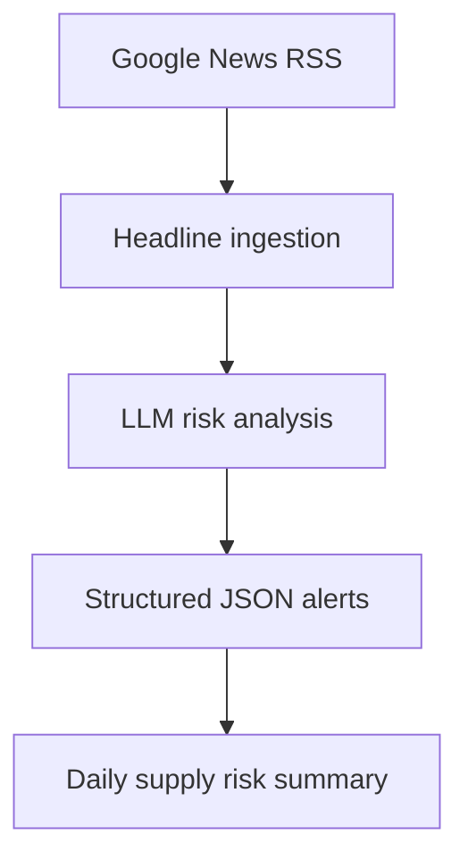

# AI Supplier Risk Monitoring Agent

An AI agent that monitors global news signals and identifies potential supply chain disruptions affecting key suppliers.

## Why this project matters
Supply chain teams often learn about disruptions too late. This prototype monitors external signals and turns them into structured risk alerts with recommended actions.

## Architecture
The agent monitors supplier-related news signals and converts them into structured supply-chain risk alerts.

## Features
- Google News RSS ingestion
- AI risk classification
- Supply chain impact analysis
- Recommended mitigation actions
- Persistent memory to suppress duplicate alerts across runs

## Agent Memory
The agent maintains lightweight memory of previously processed headlines to avoid generating duplicate alerts across runs.
A local file (`seen_headlines.json`) is automatically created on the first run to store previously analyzed headlines.
This file is excluded from version control and will be generated automatically.

## Tech Stack
- Python
- OpenAI API
- Feedparser
- python-dotenv
- LangChain

## Setup
Clone the repository:
```bash
git clone https://github.com/kenhglee/ai-supply-chain-risk-agent.git
cd ai-supply-chain-risk-agent
```
Install dependencies:
```bash
pip install -r requirements.txt
```
Create a .env file:
```bash
OPENAI_API_KEY=your_key_here
```
Run the agent:
```bash
python supplier_risk_agent.py
```
# Example Output
```text
Daily Supply Chain Risk Summary
-----------------------------------
Supplier: Murata
Headline: Murata faces component shortage due to earthquake in Japan
Risk Level: High
Impact: Potential passive component supply disruption
Recommended Action: Validate alternate suppliers and assess inventory coverage
```

## Design Decisions

This prototype intentionally keeps the architecture simple to demonstrate how external signals can be converted into actionable supply-chain intelligence.

Key design choices include:

**RSS-based signal ingestion**

Google News RSS is used as the initial signal source because it provides a lightweight way to monitor global supplier-related events without requiring paid data APIs.

**LLM-based risk interpretation**

Instead of rule-based classification, an LLM analyzes headlines and determines potential supply-chain impact. This allows the system to detect a broader range of disruptions such as natural disasters, labor strikes, or regulatory changes.

**Structured JSON output**

The LLM output is normalized into structured JSON so that the alerts could easily be consumed by downstream systems such as dashboards, notification services, or planning tools.

**Minimal pipeline architecture**

The system uses a simple pipeline:

RSS → ingestion → LLM reasoning → structured alerts

This keeps the prototype easy to understand while demonstrating the core concept of AI-assisted supply risk monitoring.

## Future Improvements

- Persistent alert storage (CSV or database)
- Keyword filtering before LLM analysis
- Email or Slack notifications
- Supplier metadata enrichment
- Dashboard for monitoring supplier risk trends