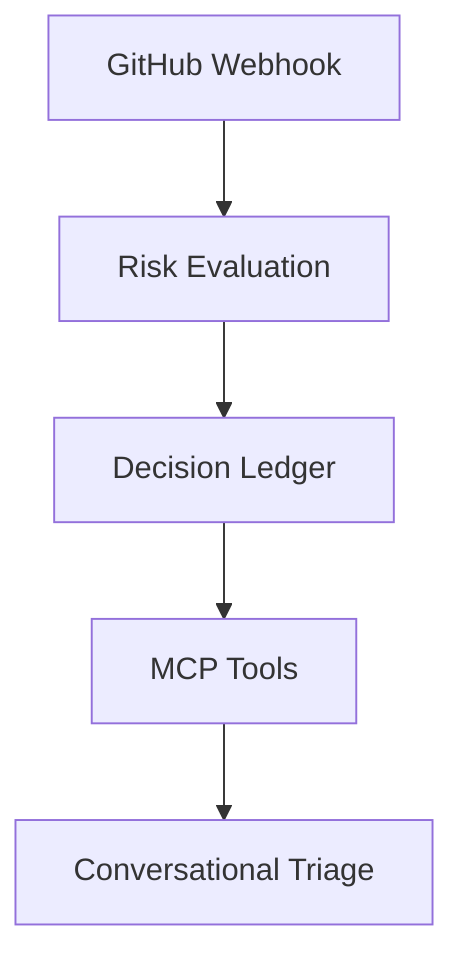
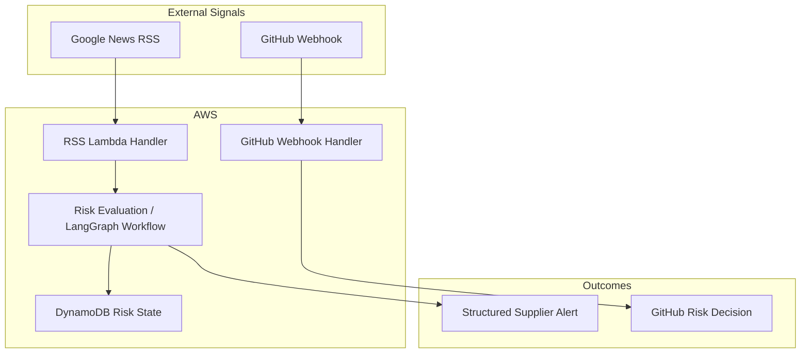
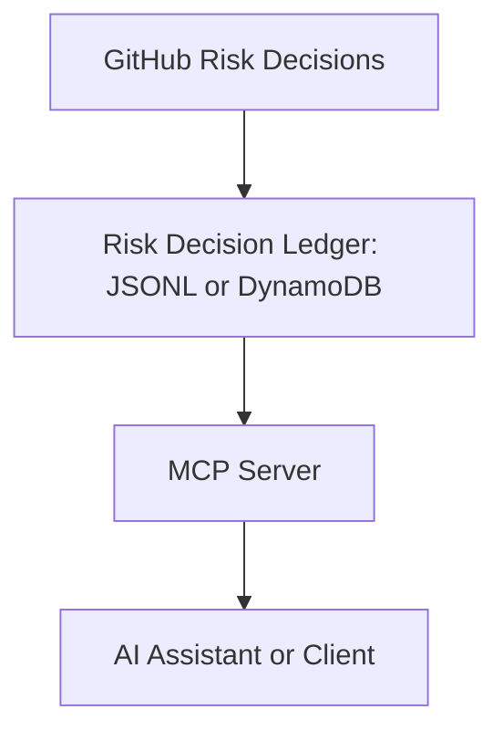

Python
LLM
License

# AI Supplier Risk Monitoring Agent

A production-grade **agentic AI system** that transforms external signals into structured decisions and exposes them as **operable workflows**.

Built to demonstrate how LLM-based systems move beyond pipelines into **stateful, controllable, and deployable enterprise AI systems**.

## Agent-Operable Risk System (MCP Layer)

This system introduces a **Model Context Protocol (MCP)** layer that turns AI workflows into **queryable, controllable, and observable systems**.

Instead of only reacting to events, the system becomes **operable by both humans and AI agents**.


```mermaid
flowchart TD
    A[GitHub Webhook] --> B[Risk Evaluation]
    B --> C[Decision Ledger]
    C --> D[MCP Tools]
    D --> E[Conversational Triage]
```


### Key Design Principle

> MCP is not part of the event pipeline — it sits **on top** as an interface layer over system capabilities.

This preserves deterministic processing while enabling safe, read-first assistant interaction.

## Overview

Supply chain disruptions often originate from external events such as natural disasters, geopolitical shifts, logistics bottlenecks, or supplier-specific issues.

This project demonstrates how those signals can be transformed into actionable intelligence by combining:

- external signal ingestion from live news feeds
- graph-based supplier inference
- FAISS-based retrieval of supplier context
- LLM-driven risk evaluation and structured alerts

## Architecture

### Core Event Pipelines


```mermaid
flowchart TD
    subgraph External Signals
        A1[Google News RSS]
        A2[GitHub Webhook]
    end

    subgraph AWS
        B1[RSS Lambda Handler]
        B2[GitHub Webhook Handler]
        C[Risk Evaluation / LangGraph Workflow]
        D[DynamoDB Risk State]
    end

    subgraph Outcomes
        E1[Structured Supplier Alert]
        E2[GitHub Risk Decision]
    end

    A1 --> B1
    A2 --> B2

    B1 --> C
    C --> D
    C --> E1

    B2 --> E2
```


### MCP + Decision Ledger Layer


```mermaid
flowchart TD
    A["GitHub Risk Decisions"] --> B["Risk Decision Ledger: JSONL or DynamoDB"]
    B --> C["MCP Server"]
    C --> D["AI Assistant or Client"]
```


## Project Structure

```text
app/
├── ingestion/
│   ├── rss_ingestion.py
│   └── github_webhook_receiver.py
├── workflows/
│   ├── supplier_risk_agent.py
│   └── github_risk_evaluator.py
├── storage/
│   ├── supplier_graph.json
│   └── supplier_profiles.json
│   └── risk_state_store.py
│   └── risk_decisions.jsonl  # (generated at runtime; not checked into git)

handlers/
├── rss_handler/
│   └── handler.py
└── github_webhook_handler/
    └── handler.py

mcp_Server.py         # MCP server exposing risk tools

tests/
├── test_rss_locally.py
├── test_lambda_handler_locally.py
└── test_github_webhook_locally.py
└── test_mcp.py
```

## MCP Tools

The MCP server exposes system capabilities as tools:

- `evaluate_github_event_risk`
→ evaluate and persist risk decisions
- `get_recent_risk_decisions`
→ query recent decision history
- `get_decisions_requiring_review`
→ filter decisions requiring human review
- `create_mock_servicenow_ticket`
→ create workflow tickets from decisions

These tools enable higher-level workflows such as:

- risk triage
- audit and review
- conversational investigation
- workflow orchestration

## How It Works

For each headline:

**1. Signal ingestion**

Headlines are fetched from Google News RSS based on supplier-related queries.

**2. Headline memory / deduplication**

Previously processed headlines are stored locally in `seen_headlines.json`.

Supplier risk state is also persisted across runs using either:

- `risk_state.csv` (default)
- DynamoDB (`supplier_risk_state`)

This allows the agent to suppress duplicate alerts and detect risk escalations over time.

**3. Risk filtering**

Only disruption-relevant signals (e.g., earthquake, strike, congestion) are processed.

**4. Graph-based supplier inference**

A lightweight dependency graph links:

- suppliers → regions / dependencies
- regions / dependencies → risk events

This step identifies candidate suppliers potentially exposed to the event.

**5. Vector retrieval (FAISS)**

Supplier profiles are embedded and stored in a vector index.

Using the headline and graph-inferred supplier candidates, the system retrieves the most relevant supplier context to ground the analysis.

**6. LangGraph workflow orchestration**

LangGraph manages the workflow as an explicit state machine.

It controls:

- whether supplier context should be retrieved
- how analysis is routed
- how invalid or weak outputs are handled

**7. LLM risk analysis**

The model generates a structured risk assessment including:

- supplier
- risk level
- impact
- recommended action
- relevant supplier context

**8. Validation and fallback handling**

Outputs are validated before being accepted.

If the signal is too weak or no supplier can be confidently identified, the system returns an explicit `inconclusive` result rather than producing unsupported recommendations.

**9. Structured output**

Final results are returned as structured alerts suitable for downstream dashboards, notifications, or planning workflows.

Each alert is compared with previously stored supplier risk state and labeled as one of:

- `new_alert`
- `suppressed`
- `escalated`
- `downgraded`
- `inconclusive`

## Features

- Google News RSS ingestion
- Headline deduplication across runs
- Keyword-based disruption filtering
- Graph-based supplier exposure inference
- FAISS-based vector retrieval of supplier context
- Supplier-specific grounding for risk analysis
- LangGraph workflow orchestration with conditional routing
- Structured JSON risk alerts (supplier, risk level, impact, action)
- Validation and fallback handling for weak or ambiguous signals
- Persistent supplier risk state with duplicate suppression and escalation tracking

## Tech Stack

- Python
- OpenAI API
- LangGraph
- LangChain
- FAISS (vector store)
- Feedparser
- python-dotenv

## Setup

Clone the repository:

```bash
git clone https://github.com/kenhglee/ai-supply-chain-risk-agent.git
cd ai-supply-chain-risk-agent
```

Install dependencies:

```bash
uv sync
```

> `requirements.txt` is kept for backward compatibility (e.g. Docker builds). For local development, prefer `uv sync`.

To add a new package:

```bash
uv add <package>
```

Create a `.env` file:

```bash
OPENAI_API_KEY=your_key_here
LLM_PROVIDER=openai
RISK_STATE_BACKEND=csv
```

Run the agent:

```bash
uv run python -m app.workflows.supplier_risk_agent
```

### Optional: Cloud Execution (AWS)

The agent can be deployed as a containerized function using AWS Lambda.

Example environment variables:

```text
OUTPUT_MODE=lambda
LLM_PROVIDER=bedrock
BEDROCK_MODEL_ID=us.anthropic.claude-haiku-4-5-20251001-v1:0
RISK_STATE_BACKEND=dynamodb
RISK_STATE_TABLE=supplier_risk_state
MAX_ALERTS_PER_RUN=1
```

In this mode:

```text
Google News RSS
→ Lambda
→ LangGraph workflow
→ Bedrock Claude
→ DynamoDB supplier_risk_state
→ structured alert summary
```

The local CSV/OpenAI path remains available for development and experimentation.

## Cloud Deployment

This project can be deployed to AWS Lambda using a container image.

Build:

```bash
docker buildx build \
  --platform linux/amd64 \
  --provenance=false \
  -t supplier-risk-agent:latest .
```

Push to ECR and configure Lambda to use:

```text
CMD ["handlers.rss_handler.handler.lambda_handler"]
CMD ["handlers.github_webhook_handler.handler.lambda_handler"]
```

The repository includes:

- Both `Dockerfile.rss` and `Dockerfile.github` for packaging the agent as a Lambda-compatible container image separately
- `.dockerignore` to keep the image small and avoid shipping local artifacts
- `.env.example` showing both local and AWS configuration options

### Event-Driven Execution

In production mode, the Lambda function is triggered on a schedule using Amazon EventBridge.

```text
EventBridge (hourly schedule)
→ Lambda container
→ Google News RSS ingestion
→ LangGraph workflow
→ Amazon Bedrock
→ DynamoDB supplier_risk_state
```

Example Lambda Response

```json
{
  "statusCode": 200,
  "body": {
    "alerts_loaded": 10,
    "alerts_processed": 1,
    "enriched_alerts": 1,
    "llm_provider": "bedrock",
    "risk_state_backend": "dynamodb"
  }
}
```

This allows the agent to continuously monitor supplier-related news and maintain persistent risk state over time without requiring a long-running server.

## GitHub Webhook Integration

The project also includes a GitHub webhook integration that demonstrates event-driven policy evaluation for software delivery workflows.

A GitHub push or pull request triggers a dedicated AWS Lambda function through a Lambda Function URL.

The Lambda:

- verifies the GitHub webhook signature
- normalizes the incoming event payload
- extracts repository, branch, and pull request information
- applies simple branch-aware risk evaluation logic
- triggers a mock ServiceNow-style ticket for higher-risk events

Example flow:

```text
GitHub Webhook
→ Lambda Function URL
→ Signature Verification
→ Payload Normalization
→ Risk Evaluation
→ Ticket / Workflow Trigger
```

## Example Output

### Example RSS driven Supply Chain Risk Evaluation

```text
Daily Supply Chain Risk Summary
-----------------------------------
New alerts: 1
High risk: 0
Medium risk: 1
Low risk: 0
Affected suppliers: Foxconn

Detailed Alerts
-----------------------------------
Supplier: Foxconn
Headline: Foxconn's investor briefing could signal major shifts in AI server supply, capacity and data center infrastructure
Risk Level: Medium risk
Impact: Potential capacity constraints and supply continuity issues
Recommended Action: Monitor developments closely and assess potential impacts on supply chain operations
Relevant Supplier Context: Foxconn - Foxconn is a global electronics manufacturing services company with large operations in China, Vietnam, and India. Key risks include labor unrest, regulatory shifts, geopolitical tensions, manufacturing disruption, and logistics delays.
-----------------------------------
```

### Example GitHub Risk Evaluation

```json
{
  "normalized_event": {
    "event_type": "pull_request",
    "repository": "kenhglee/ai-supply-chain-risk-agent",
    "pull_request": {
      "number": 1,
      "title": "Add GitHub webhook risk evaluation",
      "head_ref": "feature/github-risk-evaluation",
      "base_ref": "main"
    }
  },
  "decision": {
    "decision": "review_recommended",
    "risk_score": 60,
    "reason": "pull request targets main branch"
  }
}
```

### Example Ticket Output

```json
"ticket": {
  "ticket_id": "MOCK-CHG-XXXXXXX",
  "status": "created",
  "category": "software_supply_chain",
  "repository": "...",
  "event_type": "pull_request",
  "branch": "main",
  "risk_score": 60,
  "decision": "review_recommended"
}
```

## Design Decisions

This project intentionally balances simplicity with meaningful system behavior.

**Graph + Vector Retrieval (Hybrid Reasoning)**

The system combines two complementary forms of retrieval:

- A lightweight graph identifies which suppliers may be affected by a disruption signal
- FAISS-based vector retrieval provides supplier-specific context for the identified candidates

In practice:

```text
earthquake in Japan → Murata candidate → Murata supplier context
```

**Lightweight Knowledge Representation**

Supplier relationships are modeled using a simple JSON-based graph (supplier_graph.json) linking:

- suppliers
- regions
- dependencies
- disruption types

This enables dependency-aware reasoning without requiring a dedicated graph database, keeping the system lightweight and easy to extend.

**LangGraph-Based Workflow Orchestration**

The workflow is modeled explicitly using LangGraph.

```text
signals → graph inference → retrieval → analysis → validation → alerts
```

LangGraph makes conditional behavior easier to express and debug, including:

- whether supplier context should be retrieved
- how candidate suppliers flow through the system
- how invalid or weak model outputs are handled

This provides more control and transparency than a single prompt or free-form agent loop.

**Structured and Validated Outputs**

The LLM produces structured JSON alerts containing:

supplier
risk level
impact
recommended action
relevant supplier context

Outputs are validated before use. If no supplier can be identified or the signal is too weak, the system returns an explicit inconclusive result rather than generating unsupported recommendations.

**Lightweight Operational Memory**

Previously processed headlines are stored in seen_headlines.json.

This prevents duplicate processing across runs while keeping the system self-contained and free of external infrastructure.

## Future Improvements

- Expanded supplier and dependency graph
- Multi-hop dependency reasoning (tier-2 / tier-3 suppliers)
- Additional data sources (e.g., shipping, financial signals)
- Lightweight monitoring dashboard
- Confidence scoring for supplier-risk matches and model outputs
- Human-in-the-loop review workflow for high-severity alerts
- Persist GitHub webhook decisions to DynamoDB
- Create ServiceNow-style incident or approval tickets for high-risk events
- Post automated PR comments or commit statuses based on risk decisions
- Add Terraform modules for Lambda, Function URL, IAM, and DynamoDB deployment

Longer term, the architecture could evolve toward event-driven multi-agent coordination, deeper integration with ERP and planning systems, and infrastructure-as-code deployment with Terraform.

## Summary

This project demonstrates two complementary event-driven AI patterns:

```text
external supply chain signals
→ supplier inference
→ vector-grounded reasoning
→ structured operational alerts
```

```text
github push / pull request events
→ webhook verification
→ payload normalization
→ branch-aware risk evaluation
→ structured decision workflow
```

