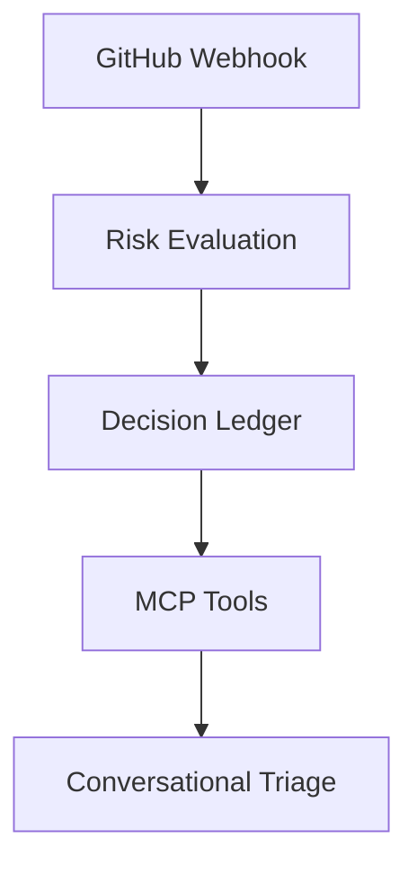
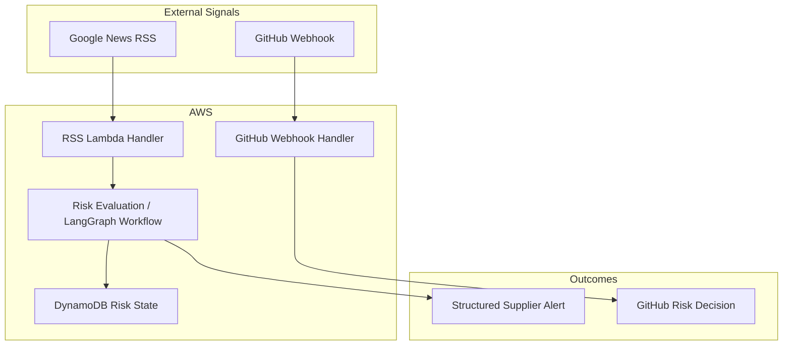
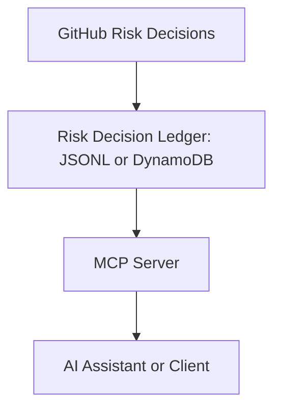

Python
LLM
License

# AI Supplier Risk Monitoring Agent

A production-grade **agentic AI system** that transforms external signals into structured decisions and exposes them as **operable workflows**.

Built to demonstrate how LLM-based systems move beyond pipelines into **stateful, controllable, and deployable enterprise AI systems**.

## Agent-Operable Risk System (MCP Layer)

This system introduces a **Model Context Protocol (MCP)** layer that turns AI workflows into **queryable, controllable, and observable systems**.

Instead of only reacting to events, the system becomes **operable by both humans and AI agents**.


```mermaid
flowchart TD
    A[GitHub Webhook] --> B[Risk Evaluation]
    B --> C[Decision Ledger]
    C --> D[MCP Tools]
    D --> E[Conversational Triage]
```


### Key Design Principle

> MCP is not part of the event pipeline — it sits **on top** as an interface layer over system capabilities.

This preserves deterministic processing while enabling safe, read-first assistant interaction.

## Overview

Supply chain disruptions often originate from external events such as natural disasters, geopolitical shifts, logistics bottlenecks, or supplier-specific issues.

This project demonstrates how those signals can be transformed into actionable intelligence by combining:

- external signal ingestion from live news feeds
- graph-based supplier inference
- FAISS-based retrieval of supplier context
- LLM-driven risk evaluation and structured alerts

## Architecture

### Core Event Pipelines


```mermaid
flowchart TD
    subgraph External Signals
        A1[Google News RSS]
        A2[GitHub Webhook]
    end

    subgraph AWS
        B1[RSS Lambda Handler]
        B2[GitHub Webhook Handler]
        C[Risk Evaluation / LangGraph Workflow]
        D[DynamoDB Risk State]
    end

    subgraph Outcomes
        E1[Structured Supplier Alert]
        E2[GitHub Risk Decision]
    end

    A1 --> B1
    A2 --> B2

    B1 --> C
    C --> D
    C --> E1

    B2 --> E2
```


### MCP + Decision Ledger Layer


```mermaid
flowchart TD
    A["GitHub Risk Decisions"] --> B["Risk Decision Ledger: JSONL or DynamoDB"]
    B --> C["MCP Server"]
    C --> D["AI Assistant or Client"]
```

### LangGraph Workflow (RSS Pipeline)

The supplier risk agent is a six-node `StateGraph`:

```
infer → decide → [retrieve] → analyze → validate → [fallback] → END
```

| Node | Role |
|---|---|
| `infer` | Maps headline to candidate suppliers via graph traversal and alias matching |
| `decide` | LLM call — returns `retrieve` or `skip` to gate context retrieval |
| `retrieve` | Calls the configured retriever backend (FAISS or Bedrock KB) |
| `analyze` | LLM call — returns a structured JSON risk alert |
| `validate` | Checks required fields; routes to `fallback` on missing or weak output |
| `fallback` | Replaces the alert with a safe `inconclusive` sentinel |

**Prompt Registry** — prompts for `decide` and `analyze` are versioned JSON files under `prompts/`. Only `"status": "approved"` versions load automatically.

**Model Registry** — LLM configurations are versioned JSON files under `models/`. The `LLM_PROVIDER` env var (`openai` or `bedrock`) overrides the registry's provider field at runtime.

**Retriever abstraction** — the `retrieve` node calls `get_retriever()`, which returns either a `FaissRetriever` or a `BedrockKBRetriever` based on `RETRIEVER_PROVIDER`. The LangGraph node is unaware of the backend.

**TraceStore / DecisionStore** — every agent run appends a structured trace record. Risk decisions from the GitHub pipeline are persisted to a separate store. Both support a JSONL backend (local/dev) and a DynamoDB backend (Lambda).

## Retrieval Backends

The `retrieve` node delegates to a retriever selected by the `RETRIEVER_PROVIDER` env var. Both backends satisfy the same duck-typed interface (`retriever_id`, `retriever_version`, `embedding_provider`, `top_k`, `retrieve(query, candidate_suppliers) → RetrieverResult`).

### FAISS (default)

`RETRIEVER_PROVIDER=faiss`

Builds an in-process FAISS index from `app/storage/supplier_profiles.json` using OpenAI embeddings. Suitable for local development and experimentation. Requires `OPENAI_API_KEY`.

### Bedrock Knowledge Base

`RETRIEVER_PROVIDER=bedrock_kb`

Delegates retrieval to an Amazon Bedrock Knowledge Base via the `bedrock-agent-runtime:Retrieve` API. The vector store backing the KB (Amazon S3 Vectors in the current deployment) is a Bedrock configuration detail — the application calls only the Retrieve API and is unaware of the storage backend.

Supplier-filtered queries use the Bedrock metadata filter API (`{"in": {"key": "supplier", "value": [...]}}`) against `.metadata.json` sidecars uploaded alongside each profile.

The class-level constant `embedding_provider = "bedrock_managed"` records in traces that the embedding model is managed by Bedrock, not by the application. `OPENAI_API_KEY` is not required on this path.

| Variable | Default | Purpose |
|---|---|---|
| `RETRIEVER_PROVIDER` | `faiss` | `faiss` or `bedrock_kb` |
| `BEDROCK_KB_ID` | — | Required when `RETRIEVER_PROVIDER=bedrock_kb` |
| `BEDROCK_KB_TOP_K` | `4` | Number of results to request from the KB |

## Storage Backends

### TraceStore (`TRACE_STORE_BACKEND`)

Every RSS pipeline run appends a structured record to the trace store. Records include per-node timing, routing decisions, LLM prompt/model metadata, and retriever metadata.

| Backend | Value | Location |
|---|---|---|
| JSONL | `jsonl` (default) | `app/storage/risk_traces.jsonl` |
| DynamoDB | `dynamodb` | Table named by `RISK_TRACES_TABLE` (default: `risk_traces`) |

Use `jsonl` locally. Use `dynamodb` on Lambda (JSONL files are lost on cold-start container recycling).

### DecisionStore (`DECISION_STORE_BACKEND`)

GitHub pipeline risk decisions are persisted separately from supplier risk traces, reflecting their different data model and workflow.

| Backend | Value | Location |
|---|---|---|
| JSONL | `jsonl` (default) | `app/storage/risk_decisions.jsonl` |
| DynamoDB | `dynamodb` | Table named by `RISK_DECISIONS_TABLE` (default: `risk_decisions`) |

## Project Structure

```text
app/
├── ingestion/
│   ├── rss_ingestion.py
│   ├── github_webhook_receiver.py
│   └── publish_supplier_corpus.py  # uploads supplier profiles to S3 for Bedrock KB
├── retrieval/
│   └── retriever.py                # FaissRetriever and BedrockKBRetriever; get_retriever() factory
├── workflows/
│   ├── supplier_risk_agent.py
│   └── github_risk_evaluator.py
├── storage/
│   ├── supplier_graph.json
│   ├── supplier_profiles.json
│   ├── risk_state_store.py
│   ├── risk_trace_store.py
│   └── risk_decisions.jsonl        # (generated at runtime; not checked into git)

handlers/
├── rss_handler/
│   └── handler.py
└── github_webhook_handler/
    └── handler.py

scripts/
└── integration_bedrock_kb.py  # live integration test for BedrockKBRetriever

mcp_server.py         # MCP server exposing risk tools

tests/
├── test_rss_locally.py
├── test_lambda_handler_locally.py
├── test_github_webhook_locally.py
├── test_mcp.py
└── test_bedrock_kb_retriever.py
```

## MCP Tools

The MCP server exposes system capabilities as tools:

- `evaluate_github_event_risk`
→ evaluate and persist risk decisions
- `get_recent_risk_decisions`
→ query recent decision history
- `get_decisions_requiring_review`
→ filter decisions requiring human review
- `create_mock_servicenow_ticket`
→ create workflow tickets from decisions

These tools enable higher-level workflows such as:

- risk triage
- audit and review
- conversational investigation
- workflow orchestration

## How It Works

For each headline:

**1. Signal ingestion**

Headlines are fetched from Google News RSS based on supplier-related queries.

**2. Headline memory / deduplication**

Previously processed headlines are stored locally in `seen_headlines.json`.

Supplier risk state is also persisted across runs using either:

- `risk_state.csv` (default)
- DynamoDB (`supplier_risk_state`)

This allows the agent to suppress duplicate alerts and detect risk escalations over time.

**3. Risk filtering**

Only disruption-relevant signals (e.g., earthquake, strike, congestion) are processed.

**4. Graph-based supplier inference**

A lightweight dependency graph links:

- suppliers → regions / dependencies
- regions / dependencies → risk events

This step identifies candidate suppliers potentially exposed to the event.

**5. Context retrieval**

The `retrieve` node calls the configured retriever backend to fetch relevant supplier context.

- **FAISS** (default): in-process similarity search over `supplier_profiles.json` using OpenAI embeddings.
- **Bedrock Knowledge Base**: managed retrieval via the Bedrock Retrieve API, backed by Amazon S3 Vectors. Supplier-filtered using metadata sidecars. Does not require `OPENAI_API_KEY`.

The candidate suppliers identified by graph inference are passed as a metadata filter, so retrieval is scoped to suppliers plausibly exposed to the event.

**6. LangGraph workflow orchestration**

LangGraph manages the workflow as an explicit state machine.

It controls:

- whether supplier context should be retrieved
- how analysis is routed
- how invalid or weak outputs are handled

**7. LLM risk analysis**

The model generates a structured risk assessment including:

- supplier
- risk level
- impact
- recommended action
- relevant supplier context

**8. Validation and fallback handling**

Outputs are validated before being accepted.

If the signal is too weak or no supplier can be confidently identified, the system returns an explicit `inconclusive` result rather than producing unsupported recommendations.

**9. Structured output**

Final results are returned as structured alerts suitable for downstream dashboards, notifications, or planning workflows.

Each alert is compared with previously stored supplier risk state and labeled as one of:

- `new_alert`
- `suppressed`
- `escalated`
- `downgraded`
- `inconclusive`

## Features

- Google News RSS ingestion
- Headline deduplication across runs
- Keyword-based disruption filtering
- Graph-based supplier exposure inference
- Retriever abstraction with two backends: FAISS (local/dev) and Bedrock Knowledge Base (managed AWS)
- Supplier metadata filtering for scoped vector retrieval
- LangGraph workflow orchestration with conditional routing (`infer → decide → retrieve → analyze → validate`)
- Prompt Registry with versioned, approval-gated prompt files
- Model Registry with versioned, approval-gated model configurations
- Structured JSON risk alerts (supplier, risk level, impact, action)
- Validation and fallback handling for weak or ambiguous signals
- Persistent supplier risk state with duplicate suppression and escalation tracking
- Risk trace observability with per-node timing, prompt metadata, model metadata, and retriever metadata
- JSONL and DynamoDB storage backends for traces and decisions (`TRACE_STORE_BACKEND`, `DECISION_STORE_BACKEND`)

## Tech Stack

- Python
- LangGraph / LangChain
- OpenAI API (LLM + FAISS embeddings on the local path)
- Amazon Bedrock (LLM via `ChatBedrockConverse`; Knowledge Base retrieval)
- Amazon S3 Vectors (vector store backend for the Bedrock Knowledge Base)
- FAISS (in-process vector store for local/dev retrieval)
- Feedparser
- python-dotenv

## Setup

Clone the repository:

```bash
git clone https://github.com/kenhglee/ai-supply-chain-risk-agent.git
cd ai-supply-chain-risk-agent
```

Install dependencies:

```bash
uv sync
```

> `requirements.txt` is kept for backward compatibility (e.g. Docker builds). For local development, prefer `uv sync`.

To add a new package:

```bash
uv add <package>
```

Create a `.env` file:

```bash
# Local development with OpenAI LLM and FAISS retriever
OPENAI_API_KEY=your_key_here
LLM_PROVIDER=openai
RISK_STATE_BACKEND=csv
RETRIEVER_PROVIDER=faiss

# Bedrock LLM + Bedrock KB retriever (OPENAI_API_KEY not required)
# LLM_PROVIDER=bedrock
# BEDROCK_MODEL_ID=us.anthropic.claude-haiku-4-5-20251001-v1:0
# RETRIEVER_PROVIDER=bedrock_kb
# BEDROCK_KB_ID=<your-kb-id>

# Bifrost gateway (local proxy, e.g. to test Bedrock models via an OpenAI-shaped client)
# LLM_PROVIDER=bifrost
# BIFROST_MODEL_ID=bedrock/us.anthropic.claude-haiku-4-5-20251001-v1:0
# BIFROST_BASE_URL=http://localhost:8080/langchain
# BIFROST_API_KEY=dummy-key
```

Run the agent:

```bash
uv run python -m app.workflows.supplier_risk_agent
```

### Environment Variables

| Variable | Default | Notes |
|---|---|---|
| `OPENAI_API_KEY` | — | Required when `RETRIEVER_PROVIDER=faiss` or `LLM_PROVIDER=openai` |
| `LLM_PROVIDER` | `openai` | `openai`, `bedrock`, or `bifrost` |
| `OPENAI_MODEL` | `gpt-4o-mini` | Model name for OpenAI provider |
| `BEDROCK_MODEL_ID` | `us.anthropic.claude-haiku-4-5-20251001-v1:0` | Model ID for Bedrock provider |
| `BIFROST_MODEL_ID` | — | Model name passed through the Bifrost gateway when `LLM_PROVIDER=bifrost` (e.g. `bedrock/us.anthropic.claude-haiku-4-5-20251001-v1:0`) |
| `BIFROST_BASE_URL` | `http://localhost:8080/langchain` | Bifrost LangChain-compatible gateway endpoint |
| `BIFROST_API_KEY` | `dummy-key` | Placeholder key; Bifrost does not validate it |
| `RETRIEVER_PROVIDER` | `faiss` | `faiss` or `bedrock_kb` |
| `BEDROCK_KB_ID` | — | Required when `RETRIEVER_PROVIDER=bedrock_kb` |
| `BEDROCK_KB_TOP_K` | `4` | Number of results to request from the KB |
| `CORPUS_S3_BUCKET` | — | S3 bucket for supplier corpus (used by publish script) |
| `CORPUS_S3_PREFIX` | `supplier-profiles/` | Key prefix within the corpus bucket |
| `RISK_STATE_BACKEND` | `csv` | `csv` or `dynamodb` |
| `RISK_STATE_FILE` | `risk_state.csv` | Used when backend is `csv` |
| `RISK_STATE_TABLE` | `supplier_risk_state` | DynamoDB table name |
| `TRACE_STORE_BACKEND` | `jsonl` | `jsonl` (local/dev) or `dynamodb` (Lambda) |
| `RISK_TRACES_TABLE` | `risk_traces` | DynamoDB table name for trace records |
| `DECISION_STORE_BACKEND` | `jsonl` | `jsonl` (local/dev) or `dynamodb` (Lambda) |
| `RISK_DECISIONS_TABLE` | `risk_decisions` | DynamoDB table name for risk decisions |
| `OUTPUT_MODE` | `csv` | `csv` (local) or `lambda` (cloud) |
| `MAX_ALERTS_PER_RUN` | `1` | Limits LLM calls per run |
| `GITHUB_WEBHOOK_SECRET` | — | Required for webhook HMAC signature verification |
| `AWS_DEFAULT_REGION` | `us-west-2` | AWS region for Bedrock and DynamoDB |

### Optional: Cloud Execution (AWS)

The agent can be deployed as a containerized function using AWS Lambda.

Example environment variables:

```text
OUTPUT_MODE=lambda
LLM_PROVIDER=bedrock
BEDROCK_MODEL_ID=us.anthropic.claude-haiku-4-5-20251001-v1:0
RETRIEVER_PROVIDER=bedrock_kb
BEDROCK_KB_ID=<your-kb-id>
RISK_STATE_BACKEND=dynamodb
RISK_STATE_TABLE=supplier_risk_state
TRACE_STORE_BACKEND=dynamodb
DECISION_STORE_BACKEND=dynamodb
MAX_ALERTS_PER_RUN=1
```

In this mode:

```text
Google News RSS
→ Lambda
→ LangGraph workflow
→ Bedrock Claude
→ DynamoDB supplier_risk_state
→ structured alert summary
```

The local CSV/OpenAI path remains available for development and experimentation.

## Cloud Deployment

This project can be deployed to AWS Lambda using a container image.

Build:

```bash
docker buildx build \
  --platform linux/amd64 \
  --provenance=false \
  -t supplier-risk-agent:latest .
```

Push to ECR and configure Lambda to use:

```text
CMD ["handlers.rss_handler.handler.lambda_handler"]
CMD ["handlers.github_webhook_handler.handler.lambda_handler"]
```

The repository includes:

- Both `Dockerfile.rss` and `Dockerfile.github` for packaging the agent as a Lambda-compatible container image separately
- `.dockerignore` to keep the image small and avoid shipping local artifacts
- `.env.example` showing both local and AWS configuration options

### Event-Driven Execution

In production mode, the Lambda function is triggered on a schedule using Amazon EventBridge.

```text
EventBridge (hourly schedule)
→ Lambda container
→ Google News RSS ingestion
→ LangGraph workflow
→ Amazon Bedrock
→ DynamoDB supplier_risk_state
```

Example Lambda Response

```json
{
  "statusCode": 200,
  "body": {
    "alerts_loaded": 10,
    "alerts_processed": 1,
    "enriched_alerts": 1,
    "llm_provider": "bedrock",
    "risk_state_backend": "dynamodb"
  }
}
```

This allows the agent to continuously monitor supplier-related news and maintain persistent risk state over time without requiring a long-running server.

## Bedrock Knowledge Base Setup

This section describes how to provision and populate the Bedrock Knowledge Base used by `RETRIEVER_PROVIDER=bedrock_kb`.

### 1. Publish the supplier corpus to S3

`app/ingestion/publish_supplier_corpus.py` transforms `supplier_profiles.json` into individually addressable S3 objects. Each supplier produces two files:

- `supplier-profiles/TSMC.txt` — the profile text
- `supplier-profiles/TSMC.txt.metadata.json` — `{"metadataAttributes": {"supplier": "TSMC"}}`

The `.metadata.json` sidecars enable the Bedrock Retrieve API's supplier metadata filter. Without them, supplier-scoped retrieval returns no results.

```bash
CORPUS_S3_BUCKET=your-bucket \
  CORPUS_S3_PREFIX=supplier-profiles/ \
  python -m app.ingestion.publish_supplier_corpus
```

Publishing is idempotent (S3 PUT). Re-run whenever `supplier_profiles.json` changes.

### 2. Sync the Knowledge Base

After publishing, trigger KB re-indexing. This is a separate operational step — publishing and indexing have different owners and failure modes.

```bash
aws bedrock-agent start-ingestion-job \
  --knowledge-base-id $BEDROCK_KB_ID \
  --data-source-id $BEDROCK_KB_DATA_SOURCE_ID \
  --region us-west-2
```

Wait for the ingestion job to reach `COMPLETE` status (typically under two minutes for three supplier profiles).

### 3. Verify with the integration smoke test

`scripts/integration_bedrock_kb.py` runs a live retrieval check against the provisioned KB. It is not part of the offline pytest suite — it requires live AWS resources and credentials.

```bash
# Full run: publish corpus, prompt for sync, then run assertions
BEDROCK_KB_ID=<id> CORPUS_S3_BUCKET=<bucket> \
  python scripts/integration_bedrock_kb.py

# Skip publish/sync — re-run assertions against an already-synced KB
BEDROCK_KB_ID=<id> CORPUS_S3_BUCKET=<bucket> \
  python scripts/integration_bedrock_kb.py --skip-publish
```

The script verifies:
- Filtered retrieval returns the correct supplier profile for TSMC, Murata, and Foxconn
- Unfiltered retrieval returns non-empty context
- `retriever_id`, `retriever_version`, and `embedding_provider` are correct

### Vector store backend

The current deployment uses **Amazon S3 Vectors** as the KB vector store (1024-dimensional float32 index, cosine distance, matching Amazon Titan Embed Text v2 defaults). This is a Bedrock configuration detail — the application calls only the `bedrock-agent-runtime:Retrieve` API and has no dependency on S3 Vectors directly.

## GitHub Webhook Integration

The project also includes a GitHub webhook integration that demonstrates event-driven policy evaluation for software delivery workflows.

A GitHub push or pull request triggers a dedicated AWS Lambda function through a Lambda Function URL.

The Lambda:

- verifies the GitHub webhook signature
- normalizes the incoming event payload
- extracts repository, branch, and pull request information
- applies simple branch-aware risk evaluation logic
- triggers a mock ServiceNow-style ticket for higher-risk events

Example flow:

```text
GitHub Webhook
→ Lambda Function URL
→ Signature Verification
→ Payload Normalization
→ Risk Evaluation
→ Ticket / Workflow Trigger
```

## Example Output

### Example RSS driven Supply Chain Risk Evaluation

```text
Daily Supply Chain Risk Summary
-----------------------------------
New alerts: 1
High risk: 0
Medium risk: 1
Low risk: 0
Affected suppliers: Foxconn

Detailed Alerts
-----------------------------------
Supplier: Foxconn
Headline: Foxconn's investor briefing could signal major shifts in AI server supply, capacity and data center infrastructure
Risk Level: Medium risk
Impact: Potential capacity constraints and supply continuity issues
Recommended Action: Monitor developments closely and assess potential impacts on supply chain operations
Relevant Supplier Context: Foxconn - Foxconn is a global electronics manufacturing services company with large operations in China, Vietnam, and India. Key risks include labor unrest, regulatory shifts, geopolitical tensions, manufacturing disruption, and logistics delays.
-----------------------------------
```

### Example GitHub Risk Evaluation

```json
{
  "normalized_event": {
    "event_type": "pull_request",
    "repository": "kenhglee/ai-supply-chain-risk-agent",
    "pull_request": {
      "number": 1,
      "title": "Add GitHub webhook risk evaluation",
      "head_ref": "feature/github-risk-evaluation",
      "base_ref": "main"
    }
  },
  "decision": {
    "decision": "review_recommended",
    "risk_score": 60,
    "reason": "pull request targets main branch"
  }
}
```

### Example Ticket Output

```json
"ticket": {
  "ticket_id": "MOCK-CHG-XXXXXXX",
  "status": "created",
  "category": "software_supply_chain",
  "repository": "...",
  "event_type": "pull_request",
  "branch": "main",
  "risk_score": 60,
  "decision": "review_recommended"
}
```

## Design Decisions

This project intentionally balances simplicity with meaningful system behavior.

**Graph + Vector Retrieval (Hybrid Reasoning)**

The system combines two complementary forms of retrieval:

- A lightweight graph identifies which suppliers may be affected by a disruption signal
- FAISS-based vector retrieval provides supplier-specific context for the identified candidates

In practice:

```text
earthquake in Japan → Murata candidate → Murata supplier context
```

**Lightweight Knowledge Representation**

Supplier relationships are modeled using a simple JSON-based graph (supplier_graph.json) linking:

- suppliers
- regions
- dependencies
- disruption types

This enables dependency-aware reasoning without requiring a dedicated graph database, keeping the system lightweight and easy to extend.

**LangGraph-Based Workflow Orchestration**

The workflow is modeled explicitly using LangGraph.

```text
signals → graph inference → retrieval → analysis → validation → alerts
```

LangGraph makes conditional behavior easier to express and debug, including:

- whether supplier context should be retrieved
- how candidate suppliers flow through the system
- how invalid or weak model outputs are handled

This provides more control and transparency than a single prompt or free-form agent loop.

**Structured and Validated Outputs**

The LLM produces structured JSON alerts containing:

supplier
risk level
impact
recommended action
relevant supplier context

Outputs are validated before use. If no supplier can be identified or the signal is too weak, the system returns an explicit inconclusive result rather than generating unsupported recommendations.

**Lightweight Operational Memory**

Previously processed headlines are stored in seen_headlines.json.

This prevents duplicate processing across runs while keeping the system self-contained and free of external infrastructure.

## Evaluation Dataset

A curated golden set and lightweight regression harness lives in `evals/`. Run it before promoting a new prompt or model version.

### Where eval cases live

```text
evals/
└── risk_classifier/
    └── golden_set_v1.jsonl    ← 15 curated cases covering all major risk categories
```

Each line is a JSON object:

```json
{
  "eval_id": "risk-001",
  "headline": "Magnitude 7.4 earthquake strikes Hualien, Taiwan...",
  "candidate_suppliers": ["TSMC"],
  "context": "TSMC is a Taiwan-based semiconductor foundry...",
  "expected": {
    "status": "ok",
    "supplier": "TSMC",
    "risk_type": "earthquake",
    "risk_level": "High",
    "must_include_terms": ["TSMC", "earthquake"]
  }
}
```

The golden set covers: clear supplier risk · ambiguous supplier mention · no relevant supplier · sanctions / export controls · logistics disruption · cyber / software dependency · outage · low / medium / high risk examples.

### How to run the eval

```bash
# Live mode (requires OPENAI_API_KEY or Bedrock credentials):
uv run python -m app.evaluation.risk_classifier_eval

# Mock mode — deterministic outputs, no credentials required:
uv run python -m app.evaluation.risk_classifier_eval --mock

# Custom dataset:
uv run python -m app.evaluation.risk_classifier_eval --dataset path/to/cases.jsonl
```

Exit code 0 if all cases pass; non-zero if any fail.

### What metrics are reported

| Metric | Description |
|---|---|
| Pass rate | Fraction of cases where all five fields matched |
| Status accuracy | Fraction where `ok` vs `inconclusive` matched |
| Supplier accuracy | Fraction where the supplier name matched (case-insensitive) |
| Risk type accuracy | Fraction where normalized risk type matched |
| Risk level accuracy | Fraction where `High` / `Medium` / `Low` matched |

A failure report lists each failing case with the expected vs actual value for each mismatched field.

The report header includes the prompt and model registry metadata used for the run:

```text
Registry
  prompt_id:          risk_classifier
  prompt_version:     v1
  model_id:           risk_analysis_primary
  model_version:      v1
  runtime_provider:   openai
  runtime_model_name: gpt-4o-mini
```

### How this supports prompt / model promotion governance

Before changing `status` from `"draft"` to `"approved"` on a new prompt or model version:

1. Add a new version file under `prompts/risk_classifier/` or `models/risk_analysis_primary/`.
2. Load it with `require_approved=False` and point the evaluator at it (env var or registry version override).
3. Run the eval harness and review the report.
4. If pass rate meets the acceptance threshold, set `"status": "approved"` to promote it.

The eval harness enforces no specific pass threshold — that decision belongs to the team — but the report provides all the signal needed to make it.

## Model Registry

LLM model configurations are versioned and stored as JSON files under `models/`, following the same governance pattern as the Prompt Registry.

### Where model definitions live

```text
models/
├── risk_analysis_primary/
│   └── v1.json        ← model used in the risk classification (analyze_risk) node
└── triage_primary/
    └── v1.json        ← model used in the triage decision (decide_tool_use) node
```

Each file follows this schema:

```json
{
  "model_id": "risk_analysis_primary",
  "version": "v1",
  "status": "approved",
  "owner": "Ken Hyounggon Lee",
  "created_at": "2026-06-18",
  "description": "Primary model for supply chain risk classification.",
  "provider": "openai",
  "model_name": "gpt-4o-mini",
  "use_case": "risk_classification"
}
```

### Approval workflow

The same approval gate from the Prompt Registry applies here. Only versions with `"status": "approved"` are loaded automatically. A `"draft"` or `"pending"` version is never selected by default:

```python
from app.model_registry import get_model

# Production: loads the latest approved version
record = get_model("risk_analysis_primary")

# Development / testing: load a specific draft without the approval check
record = get_model("risk_analysis_primary", version="v2", require_approved=False)
```

### Version management

Add a new model version by creating a new file, e.g. `models/risk_analysis_primary/v2.json`, with `"status": "draft"`. Validate it, then set `"status": "approved"` to promote it. The registry automatically selects the highest-numbered approved version (`v2` > `v1`).

### Relationship to Prompt Registry

The Model Registry and Prompt Registry are independent but complementary. Each LangGraph node draws from both:

| Node | Prompt | Model |
|---|---|---|
| `decide_tool_use` | `triage_agent` | `triage_primary` |
| `analyze_risk` | `risk_classifier` | `risk_analysis_primary` |

The `LLM_PROVIDER` env var overrides the registry's `provider` field (for Bedrock deployments). `OPENAI_MODEL` and `BEDROCK_MODEL_ID` override the registry's `model_name` field. When neither env var is set, the registry is the sole source of truth.

### How model metadata appears in traces

Each risk trace in `app/storage/risk_traces.jsonl` includes a `model_metadata` field:

```json
"model_metadata": [
  {
    "model_id": "triage_primary",
    "model_version": "v1",
    "model_status": "approved",
    "model_provider": "openai",
    "model_name": "gpt-4o-mini",
    "model_description": "Primary model for triage decisions..."
  },
  {
    "model_id": "risk_analysis_primary",
    "model_version": "v1",
    "model_status": "approved",
    "model_provider": "openai",
    "model_name": "gpt-4o-mini",
    "model_description": "Primary model for supply chain risk classification..."
  }
]
```

The `/api/traces/{identifier}/explanation` endpoint also includes this in the human-readable explanation text.

## Prompt Registry

LLM prompts are versioned and stored as JSON files under `prompts/`, separate from application code.

### Where prompts live

```text
prompts/
├── risk_classifier/
│   └── v1.json        ← analyzes a headline and returns a structured risk alert
└── triage_agent/
    └── v1.json        ← decides whether supplier-context retrieval is needed
```

Each file follows this schema:

```json
{
  "prompt_id": "risk_classifier",
  "version": "v1",
  "status": "approved",
  "owner": "Ken Hyounggon Lee",
  "created_at": "2026-06-18",
  "description": "...",
  "template": "..."
}
```

Templates use Python `str.format()` placeholders (`{headline}`, `{candidate_suppliers}`, `{context}`, `{suppliers}`). Literal `{` and `}` in JSON schema examples are escaped as `{{` and `}}`.

### How to add a new prompt version

1. Create a new file, e.g. `prompts/risk_classifier/v2.json`, with `"status": "draft"`.
2. Iterate on the template and test it.
3. Set `"status": "approved"` when ready.
4. The registry automatically selects the latest approved version by numeric suffix (`v2` > `v1`).

### How approval status works

The registry only loads a prompt automatically (when no version is specified) if its `status` is `"approved"`. A `"draft"` or other status is never selected by default. This prevents untested prompts from reaching production. You can still load a specific draft version explicitly:

```python
from app.prompt_registry import get_prompt

record = get_prompt("risk_classifier", version="v2")
```

### How prompt metadata appears in traces

Each risk trace written to `app/storage/risk_traces.jsonl` includes a `prompt_metadata` field listing the prompt(s) used:

```json
"prompt_metadata": [
  {
    "prompt_id": "triage_agent",
    "prompt_version": "v1",
    "prompt_status": "approved",
    "prompt_description": "Decides whether supplier-context retrieval is needed..."
  },
  {
    "prompt_id": "risk_classifier",
    "prompt_version": "v1",
    "prompt_status": "approved",
    "prompt_description": "Analyzes a supply chain headline and returns a structured JSON risk alert..."
  }
]
```

The `/api/traces/{identifier}/explanation` endpoint also includes this information in the human-readable explanation text.

## Validation Status

| Test | Status |
|---|---|
| Unit tests (`pytest tests/`) | Passing — all suites including `test_bedrock_kb_retriever.py` (12 tests, mock-based) |
| Bedrock KB integration test (`scripts/integration_bedrock_kb.py --skip-publish`) | Passed — 4/4 assertions against live AWS resources |
| End-to-end LangGraph run with `RETRIEVER_PROVIDER=bedrock_kb` | Passed — full `infer → decide → retrieve → analyze → validate` path executed |
| `OPENAI_API_KEY` not required on Bedrock KB path | Confirmed — workflow ran without it when `LLM_PROVIDER=bedrock` and `RETRIEVER_PROVIDER=bedrock_kb` |

Trace record from the end-to-end run confirmed:

```json
"retriever_metadata": {
  "retriever_id": "bedrock_kb_supplier_profiles",
  "retriever_version": "v1",
  "embedding_provider": "bedrock_managed",
  "top_k": 4
}
```

## Future Improvements

- Expanded supplier and dependency graph
- Multi-hop dependency reasoning (tier-2 / tier-3 suppliers)
- Additional data sources (e.g., shipping, financial signals)
- Lightweight monitoring dashboard
- Confidence scoring for supplier-risk matches and model outputs
- Human-in-the-loop review workflow for high-severity alerts
- Persist GitHub webhook decisions to DynamoDB
- Create ServiceNow-style incident or approval tickets for high-risk events
- Post automated PR comments or commit statuses based on risk decisions
- Add Terraform modules for Lambda, Function URL, IAM, and DynamoDB deployment

Longer term, the architecture could evolve toward event-driven multi-agent coordination, deeper integration with ERP and planning systems, and infrastructure-as-code deployment with Terraform.

## Summary

This project demonstrates two complementary event-driven AI patterns:

```text
external supply chain signals
→ supplier inference
→ vector-grounded reasoning
→ structured operational alerts
```

```text
github push / pull request events
→ webhook verification
→ payload normalization
→ branch-aware risk evaluation
→ structured decision workflow
```

