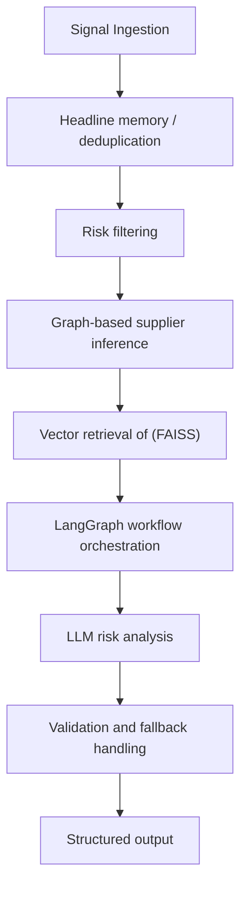

Python
OpenAI
License

# AI Supplier Risk Monitoring Agent

An AI-powered supply chain risk agent that ingests live news signals, maps disruption events to suppliers using a lightweight knowledge graph, retrieves supplier context with FAISS, and generates structured risk assessments through a LangGraph-orchestrated workflow.

## Overview

Supply chain disruptions often originate from external events such as natural disasters, geopolitical shifts, logistics bottlenecks, or supplier-specific issues.

This project demonstrates how those signals can be transformed into actionable intelligence by combining:

- external signal ingestion from live news feeds
- graph-based supplier inference
- FAISS-based retrieval of supplier context
- LLM-driven risk evaluation and structured alerts

## Architecture


```mermaid
flowchart TD
    A["Signal Ingestion"]
    B["Headline memory / deduplication"]
    C["Risk filtering"]
    D["Graph-based supplier inference"]
    E["Vector retrieval of (FAISS)"]
    F["LangGraph workflow orchestration"]
    G["LLM risk analysis"]
    H["Validation and fallback handling"]
    I["Structured output"]

    A --> B
    B --> C
    C --> D
    D --> E
    E --> F
    F --> G
    G --> H
    H --> I
```


## How It Works

For each headline:

**1. Signal ingestion**

Headlines are fetched from Google News RSS based on supplier-related queries.

**2. Headline memory / deduplication**

Previously processed headlines are stored locally in `seen_headlines.json`.

Supplier risk state is also persisted across runs using either:

- `risk_state.csv` (default)
- DynamoDB (`supplier_risk_state`)

This allows the agent to suppress duplicate alerts and detect risk escalations over time.

**3. Risk filtering**

Only disruption-relevant signals (e.g., earthquake, strike, congestion) are processed.

**4. Graph-based supplier inference**

A lightweight dependency graph links:

- suppliers → regions / dependencies
- regions / dependencies → risk events

This step identifies candidate suppliers potentially exposed to the event.

**5. Vector retrieval (FAISS)**

Supplier profiles are embedded and stored in a vector index.

Using the headline and graph-inferred supplier candidates, the system retrieves the most relevant supplier context to ground the analysis.

**6. LangGraph workflow orchestration**

LangGraph manages the workflow as an explicit state machine.

It controls:

- whether supplier context should be retrieved
- how analysis is routed
- how invalid or weak outputs are handled

**7. LLM risk analysis**

The model generates a structured risk assessment including:

- supplier
- risk level
- impact
- recommended action
- relevant supplier context

**8. Validation and fallback handling**

Outputs are validated before being accepted.

If the signal is too weak or no supplier can be confidently identified, the system returns an explicit `inconclusive` result rather than producing unsupported recommendations.

**9. Structured output**

Final results are returned as structured alerts suitable for downstream dashboards, notifications, or planning workflows.

Each alert is compared with previously stored supplier risk state and labeled as one of:

- `new_alert`
- `suppressed`
- `escalated`
- `downgraded`
- `inconclusive`

## Features

- Google News RSS ingestion
- Headline deduplication across runs
- Keyword-based disruption filtering
- Graph-based supplier exposure inference
- FAISS-based vector retrieval of supplier context
- Supplier-specific grounding for risk analysis
- LangGraph workflow orchestration with conditional routing
- Structured JSON risk alerts (supplier, risk level, impact, action)
- Validation and fallback handling for weak or ambiguous signals
- Persistent supplier risk state with duplicate suppression and escalation tracking

## Tech Stack

- Python
- OpenAI API
- LangGraph
- LangChain
- FAISS (vector store)
- Feedparser
- python-dotenv

## Setup

Clone the repository:

```bash
git clone https://github.com/kenhglee/ai-supply-chain-risk-agent.git
cd ai-supply-chain-risk-agent
```

Install dependencies:

```bash
pip install -r requirements.txt
```

Create a .env file:

```bash
OPENAI_API_KEY=your_key_here
LLM_PROVIDER=openai
RISK_STATE_BACKEND=csv
```

Run the agent:

```bash
python supplier_risk_agent.py
```

### Optional: Amazon Bedrock + DynamoDB

To use Bedrock for reasoning:

```bash
LLM_PROVIDER=bedrock
BEDROCK_MODEL_ID=us.anthropic.claude-haiku-4-5-20251001-v1:0
AWS_DEFAULT_REGION=us-west-2
```

To persist risk state in DynamoDB instead of a local CSV:

```bash
RISK_STATE_BACKEND=dynamodb
RISK_STATE_TABLE=supplier_risk_state
```

## Example Output

```text
Daily Supply Chain Risk Summary
-----------------------------------
New alerts: 1
High risk: 0
Medium risk: 1
Low risk: 0
Affected suppliers: Foxconn

Detailed Alerts
-----------------------------------
Supplier: Foxconn
Headline: Foxconn's investor briefing could signal major shifts in AI server supply, capacity and data center infrastructure
Risk Level: Medium risk
Impact: Potential capacity constraints and supply continuity issues
Recommended Action: Monitor developments closely and assess potential impacts on supply chain operations
Relevant Supplier Context: Foxconn - Foxconn is a global electronics manufacturing services company with large operations in China, Vietnam, and India. Key risks include labor unrest, regulatory shifts, geopolitical tensions, manufacturing disruption, and logistics delays.
-----------------------------------
```

## Design Decisions

This project intentionally balances simplicity with meaningful system behavior.

**Graph + Vector Retrieval (Hybrid Reasoning)**

The system combines two complementary forms of retrieval:

- A lightweight graph identifies which suppliers may be affected by a disruption signal
- FAISS-based vector retrieval provides supplier-specific context for the identified candidates

In practice:

```text
earthquake in Japan → Murata candidate → Murata supplier context
```

**Lightweight Knowledge Representation**

Supplier relationships are modeled using a simple JSON-based graph (supplier_graph.json) linking:

- suppliers
- regions
- dependencies
- disruption types

This enables dependency-aware reasoning without requiring a dedicated graph database, keeping the system lightweight and easy to extend.

**LangGraph-Based Workflow Orchestration**

The workflow is modeled explicitly using LangGraph.

```text
signals → graph inference → retrieval → analysis → validation → alerts
```

LangGraph makes conditional behavior easier to express and debug, including:

- whether supplier context should be retrieved
- how candidate suppliers flow through the system
- how invalid or weak model outputs are handled

This provides more control and transparency than a single prompt or free-form agent loop.

**Structured and Validated Outputs**

The LLM produces structured JSON alerts containing:

supplier
risk level
impact
recommended action
relevant supplier context

Outputs are validated before use. If no supplier can be identified or the signal is too weak, the system returns an explicit inconclusive result rather than generating unsupported recommendations.

**Lightweight Operational Momery**

Previously processed headlines are stored in seen_headlines.json.

This prevents duplicate processing across runs while keeping the system self-contained and free of external infrastructure.

## Future Improvements

- Expanded supplier and dependency graph
- Multi-hop dependency reasoning (tier-2 / tier-3 suppliers)
- Additional data sources (e.g., shipping, financial signals)
- Lightweight monitoring dashboard
- Confidence scoring for supplier-risk matches and model outputs
- Human-in-the-loop review workflow for high-severity alerts

Longer term, the architecture could evolve toward multi-agent coordination and deeper integration with ERP and planning systems.

## Summary

This project demonstrates a practical pattern for AI-driven operational intelligence:

```text
external signals
→ graph-based supplier inference
→ vector-grounded reasoning
→ structured decision support
```

