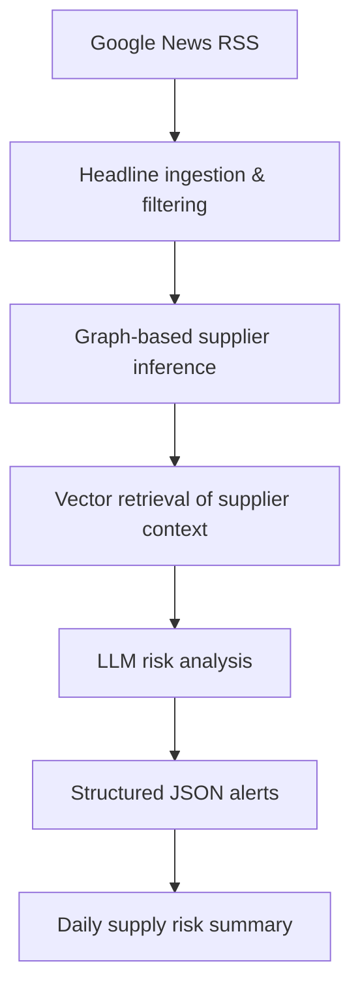

# AI Supplier Risk Monitoring Agent
An AI-powered agent that monitors global news signals and identifies potential supply chain risks affecting key suppliers using graph-assisted retrieval and LLM reasoning.

## Overview
Supply chain disruptions often originate from external events such as natural disasters, geopolitical shifts, or logistics bottlenecks.

This project explores how these signals can be transformed into actionable intelligence by combining:

- external signal ingestion (news)
- dependency-aware supplier inference (graph)
- retrieval-augmented context (vector search)
- LLM-based risk evaluation

## Architecture

```mermaid
flowchart TD
    A["Google News RSS"]
    B["Headline ingestion & filtering"]
    C["Graph-based supplier inference"]
    D["Vector retrieval of supplier context"]
    E["LLM risk analysis"]
    F["Structured JSON alerts"]
    G["Daily supply risk summary"]

    A --> B
    B --> C
    C --> D
    D --> E
    E --> F
    F --> G
```

## How It Works
For each headline:

**1. Signal ingestion**
Headlines are fetched from Google News RSS based on supplier-related queries.

**2. Risk filtering**
Only disruption-relevant signals (e.g., earthquake, strike, congestion) are processed.

**3. Graph-based inference**
A lightweight dependency graph links:
- suppliers → regions / dependencies
- regions / dependencies → risk events

This step identifies candidate suppliers exposed to the event.

**4. Vector retrieval (FAISS)**
Supplier profiles are embedded and stored in a vector index.
The system retrieves the most relevant supplier context using:
- headline + graph-inferred suppliers

**5. LLM risk analysis**
The model evaluates:
- likelihood of disruption
- operational impact
- recommended mitigation actions

**6. Structured output**
Results are returned as structured alerts.


## Features
- Google News RSS ingestion
- Keyword-based disruption filtering
- Graph-assisted supplier exposure inference
- Retrieval-augmented reasoning (FAISS + embeddings)
- Supplier-specific contextual grounding
- Structured JSON alerts (risk, impact, action)
- Lightweight memory to avoid duplicate processing


## Tech Stack
- Python
- OpenAI API
- LangChain
- FAISS (vector store)
- Feedparser
- python-dotenv


## Setup
Clone the repository:
```bash
git clone https://github.com/kenhglee/ai-supply-chain-risk-agent.git
cd ai-supply-chain-risk-agent
```
Install dependencies:
```bash
pip install -r requirements.txt
```
Create a .env file:
```bash
OPENAI_API_KEY=your_key_here
```
Run the agent:
```bash
python supplier_risk_agent.py
```
## Example Output
```text
Daily Supply Chain Risk Summary
-----------------------------------
New alerts: 1
High risk: 0
Medium risk: 1
Low risk: 0
Affected suppliers: Foxconn

Detailed Alerts
-----------------------------------
Supplier: Foxconn
Headline: Foxconn's investor briefing could signal major shifts in AI server supply, capacity and data center infrastructure
Risk Level: Medium risk
Impact: Potential capacity constraints and supply continuity issues
Recommended Action: Monitor developments closely and assess potential impacts on supply chain operations
Relevant Supplier Context: Foxconn - Foxconn is a global electronics manufacturing services company with large operations in China, Vietnam, and India. Key risks include labor unrest, regulatory shifts, geopolitical tensions, manufacturing disruption, and logistics delays.
-----------------------------------
```

## Design Decisions

This project intentionally balances simplicity with meaningful system behavior.

**Graph + Retrieval (Hybrid Reasoning)**
- The graph layer identifies who might be affected
- The vector layer provides context on why and how
This combination enables more realistic supply-chain reasoning than either approach alone.

**Lightweight Knowledge Representation**
- Supplier relationships are modeled using a simple JSON-based graph
- No external graph database is required
- Designed for clarity and extensibility

**Deterministic Pipeline**
The workflow is explicitly orchestrated:
```text
signals → graph inference → retrieval → LLM → alerts
```
This avoids the complexity of autonomous agent loops while remaining transparent and debuggable.

**Structured JSON output**
The LLM output is normalized into structured JSON so that the alerts could easily be consumed by downstream systems such as dashboards, notification services, or planning tools.

**Lightweight Momery**
The agent tracks previously processed headlines using a local `seen_headlines.json` file to avoid duplicate analysis across runs. This provides simple persistence without requiring external storage.

**Retrieval-Based Context Grounding**
The agent tracks previously processed headlines using a local `seen_headlines.json` file to avoid duplicate analysis across runs. This provides simple persistence without requiring external storage.


## Future Improvements

- Persistent alert storage (CSV or database)
- Expanded supplier and dependency graph
- Multi-hop dependency reasoning (tier-2 / tier-3 suppliers)
- Additional data sources (e.g., shipping, financial signals)
- Lightweight monitoring dashboard


## Summary

This project demonstrates a practical pattern for AI-driven operational intelligence:
```text
external signals
→ dependency-aware inference
→ retrieval-augmented reasoning
→ structured decision support
```