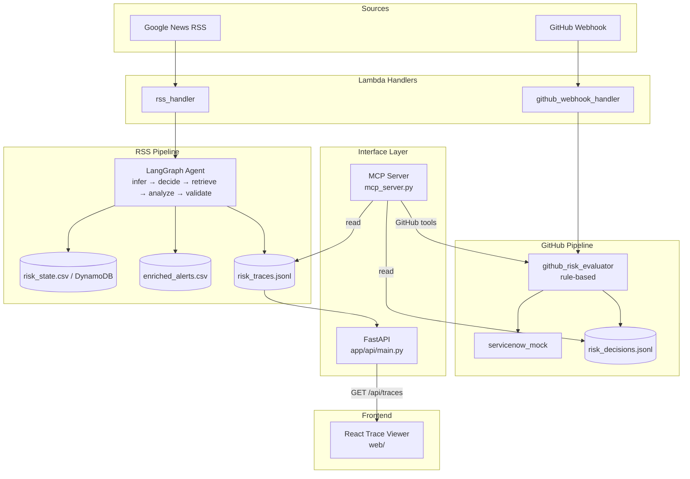
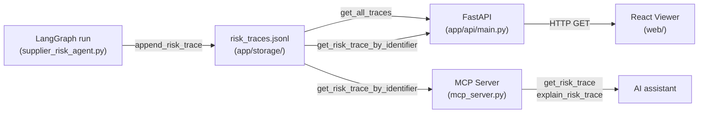

# Architecture

## System Purpose

This project is a **supply chain risk monitoring system**. It watches two classes of signal and turns them into structured risk decisions:

1. **Supplier disruption news** — Google News RSS headlines about key hardware suppliers (TSMC, Foxconn, Murata) are processed through an LLM-powered LangGraph agent and emitted as enriched risk alerts.
2. **Software supply chain events** — GitHub push and pull-request webhooks are evaluated by a rule-based scorer; high-risk events trigger a mock ServiceNow change ticket.

A **risk trace observability layer** records per-node timing and decisions for every LangGraph run. Traces are exposed via a FastAPI HTTP layer and a React trace viewer, and are also queryable through MCP tools.

---

## Current Architecture



---

## Repository Layout

```
app/
  api/
    main.py                   # FastAPI app — trace HTTP endpoints
  ingestion/
    rss_ingestion.py          # Fetches Google News RSS; returns raw headline dicts
    github_webhook_receiver.py # Verifies HMAC, normalizes GitHub payload, calls evaluator
  integrations/
    servicenow_mock.py        # Returns a fake ServiceNow CHANGE ticket dict
  storage/
    risk_state_store.py       # Appends / queries risk_decisions.jsonl
    risk_trace_store.py       # Appends / queries risk_traces.jsonl; build_trace_explanation
    supplier_graph.json       # Knowledge graph: [source, relation, target] triples
    supplier_profiles.json    # Text profiles for FAISS vectorstore
  workflows/
    supplier_risk_agent.py    # LangGraph agent (RSS pipeline)
    github_risk_evaluator.py  # Rule-based risk scorer (GitHub pipeline)

handlers/
  rss_handler/handler.py           # Lambda entry point for RSS pipeline
  github_webhook_handler/handler.py # Lambda entry point for GitHub webhooks

mcp_server.py    # FastMCP server — GitHub pipeline tools + risk trace tools

web/             # Vite + React + TypeScript trace viewer
  src/
    App.tsx      # Two-pane trace list / detail UI
    api.ts       # Typed fetch wrappers for FastAPI endpoints
    types.ts     # TraceSummary, TraceDetail, TraceStep interfaces
```

---

## Developer Workflow

```bash
# Install Python dependencies
uv sync

# Add a new Python package
uv add <package>

# Run the RSS pipeline locally (requires OPENAI_API_KEY)
uv run python -m app.workflows.supplier_risk_agent

# Start the FastAPI server
uv run uvicorn app.api.main:app --reload

# Start the MCP server
uv run python mcp_server.py

# Start the React trace viewer (separate terminal, from web/)
cd web && npm run dev
```

`requirements.txt` is kept for Lambda Docker builds. `uv` manages the local `.venv`.

---

## Pipeline 1 — RSS Supplier Risk

### Trigger

AWS EventBridge invokes `handlers/rss_handler/handler.py` on a schedule. Locally: `uv run python -m app.workflows.supplier_risk_agent`.

### Request Flow

```
EventBridge (schedule)
  → rss_handler.lambda_handler
    → run_supplier_risk_flow()
      → bootstrap_alerts_csv_from_rss()   # fetch RSS, deduplicate, append to alerts.csv
      → for each "new" alert (up to MAX_ALERTS_PER_RUN):
          → is_actionable_alert()          # keyword pre-filter (no LLM call)
          → if not actionable: append_risk_trace(trace_steps=[])  → skip
          → generate trace_id (uuid4 hex)
          → LangGraph app.invoke()         # 6-node agent; nodes write to trace_steps
          → compare_and_update_risk_state() # detect escalation/suppression
          → append_risk_trace(...)         # persist to risk_traces.jsonl
      → write_enriched_alerts()           # append to enriched_alerts.csv
      → risk_store.flush()               # persist risk state to CSV or DynamoDB
  → return { statusCode: 200, body: summary_json }
```

### LangGraph Agent

The agent is a compiled `StateGraph` with six nodes:

```
infer → decide ──retrieve──► analyze → validate ──end──► END
                └──skip──────►         └──fallback──► fallback → END
```

| Node | What it does | Records in trace |
|---|---|---|
| `infer` | Maps headline to candidate suppliers via graph traversal and alias matching | timing only |
| `decide` | LLM call — returns `"retrieve"` or `"skip"` | timing + decision |
| `retrieve` | FAISS similarity search over `supplier_profiles.json` | timing only |
| `analyze` | LLM call — returns structured JSON alert | timing; error if parse fails |
| `validate` | Checks required fields; routes to `fallback` on failure | timing + `"valid"` or `"fallback"` |
| `fallback` | Replaces alert with a safe `inconclusive` sentinel | timing only |

Each node records its own `started_at`, `ended_at`, `duration_ms`, and optional `decision` / `error` into `state["trace_steps"]` before returning.

**Module-level initialization**: `supplier_risk_agent.py` builds the FAISS index and instantiates the LLM at import time. `OPENAI_API_KEY` must be set even when `LLM_PROVIDER=bedrock` because `OpenAIEmbeddings` is always used for FAISS.

### Risk State Change Types

After the agent runs, `compare_and_update_risk_state` compares the new alert against the persisted state for `(supplier, risk_type)`:

| Type | Condition |
|---|---|
| `new_alert` | No prior state for this supplier/risk_type pair |
| `escalated` | New risk level is higher than prior |
| `suppressed` | Same risk level as prior (duplicate) |
| `downgraded` | New risk level is lower than prior |
| `inconclusive` | Alert status is not `"ok"`, or fields are missing |
| `ignored` | Headline failed the pre-filter; no LangGraph run |

---

## Pipeline 2 — GitHub Webhook Risk Evaluator

### Trigger

GitHub sends `push` and `pull_request` webhook events to the Lambda Function URL exposed by `handlers/github_webhook_handler/handler.py`.

### Request Flow

```
GitHub webhook (POST to Lambda Function URL)
  → github_webhook_handler.lambda_handler
    → process_github_webhook(event)
      → verify HMAC-SHA256 signature (X-Hub-Signature-256)
      → normalize payload → { event_type, repository, push|pull_request, ... }
      → evaluate_github_event_risk(normalized)    # rule-based, no LLM
      → if decision ∈ {review_recommended, manual_review_required}:
          → create_servicenow_ticket()             # mock only
  → return { statusCode: 200, normalized_event, decision, ticket }
```

Note: the webhook handler does **not** persist decisions to `risk_decisions.jsonl`. Persistence is handled only by the MCP server.

### Risk Score Rules

| Event | Branch / Target | Decision | Score |
|---|---|---|---|
| `push` | `refs/heads/main` | `manual_review_required` | 80 |
| `push` | `refs/heads/release/*` | `manual_review_required` | 85 |
| `push` | other | `allow` | 20 |
| `pull_request` | `main` | `review_recommended` | 60 |
| `pull_request` | `release/*` | `manual_review_required` | 75 |
| `pull_request` | other | `allow` | 25 |
| other event type | — | `ignore` | 0 |

---

## Risk Trace Observability

Every call to `process_alert_row` produces one trace record written to `app/storage/risk_traces.jsonl`.

### What is captured

- `alert_id` + `trace_id` — stable identifiers threaded through the entire run
- `headline`, `created_at`, `run_duration_ms` — run-level metadata
- `tool_decision`, `final_status`, `supplier`, `risk_type`, `risk_level`, `change_type` — outcome fields
- `trace_steps` — list of per-node records, each with `node_name`, `started_at`, `ended_at`, `duration_ms`, and optionally `decision` or `error`

For alerts that fail the `is_actionable_alert` pre-filter, `trace_steps` is `[]` and `change_type` is `"ignored"`.

### Where traces flow



---

## MCP Server

`mcp_server.py` runs a FastMCP server (`supply-chain-risk`). It is a separate process, not invoked by the Lambda handlers.

### Tools

**GitHub pipeline tools**

| Tool | Description |
|---|---|
| `evaluate_github_event_risk` | Calls the rule-based evaluator and persists the decision to `risk_decisions.jsonl` |
| `get_recent_risk_decisions` | Returns the N most recent decisions from `risk_decisions.jsonl` (default 20) |
| `get_decisions_requiring_review` | Returns decisions with `manual_review_required` or `review_recommended` (default 10) |
| `create_mock_servicenow_ticket` | Creates a mock ServiceNow ticket for a prior decision and persists the result |

**Risk trace tools**

| Tool | Description |
|---|---|
| `get_risk_trace` | Returns the raw trace record for an `alert_id` or `trace_id`; includes `matched_by` field |
| `explain_risk_trace` | Returns a human-readable explanation: outcome, node sequence, slowest node, decisions, errors |

Start with: `uv run python mcp_server.py` (blocks on stdin waiting for an MCP client).  
Test interactively: `npx @modelcontextprotocol/inspector uv run python mcp_server.py`

---

## FastAPI Layer

`app/api/main.py` exposes trace data over HTTP. CORS is enabled for `http://localhost:5173` (Vite dev server).

| Endpoint | Response |
|---|---|
| `GET /health` | `{"status": "ok"}` |
| `GET /api/traces` | Summary list (alert_id, trace_id, headline, final_status, created_at, run_duration_ms), newest first |
| `GET /api/traces/{identifier}` | Full trace record; matches `alert_id` or `trace_id`; 404 on miss |
| `GET /api/traces/{identifier}/explanation` | `{"explanation": "<text>"}` using `build_trace_explanation` |

Start with: `uv run uvicorn app.api.main:app --reload`

---

## React Trace Viewer

`web/` is a Vite + React + TypeScript app. Start with `cd web && npm run dev`.

### UI Layout

Two-pane split:

- **Left pane** — `TraceList`: shows all traces from `GET /api/traces`. Each row displays `alert_id`, `final_status` badge, `run_duration_ms`, and `created_at`. Clicking a row loads the detail pane.
- **Right pane** — `TraceDetailPanel`: shows headline, full metadata, node sequence with per-node timing (slowest node highlighted), decisions table, error table if any, and the explanation text from `GET /api/traces/{id}/explanation`.

### TypeScript Interfaces (`src/types.ts`)

```typescript
interface TraceSummary {
  alert_id, trace_id, headline, final_status, created_at, run_duration_ms
}

interface TraceStep {
  node_name, started_at, ended_at, duration_ms
  decision?: string   // present on "decide" and "validate" nodes
  error?: string      // present when analyze node fails to parse LLM output
}

interface TraceDetail extends TraceSummary {
  tool_decision, supplier, risk_type, risk_level, change_type
  trace_steps: TraceStep[]
}
```

### Data Fetching (`src/api.ts`)

Three typed fetch wrappers: `fetchTraces()`, `fetchTraceDetail(identifier)`, `fetchExplanation(identifier)`. All target `http://localhost:8000`.

---

## Data Models and Storage

### LangGraph State (`RiskState`)

```python
class RiskState(TypedDict):
    alert_id: str
    trace_id: str
    headline: str
    candidate_suppliers: List[str]
    context: str
    tool_decision: Optional[Literal["retrieve", "skip"]]
    alert: Optional[dict]
    is_valid: Optional[bool]
    trace_steps: List[dict]
```

### LLM Alert Output (from `analyze` node)

```json
{
  "status": "ok" | "inconclusive",
  "supplier": "TSMC" | null,
  "risk_type": "earthquake" | "flood" | "strike" | "sanctions" | "outage" | "export_controls" | ...,
  "risk_level": "High" | "Medium" | "Low" | null,
  "impact": "...",
  "recommended_action": "...",
  "relevant_supplier_context": "..."
}
```

### Enriched Alert Row (`enriched_alerts.csv`)

`processed_at`, `alert_id`, `trace_id`, `trace_steps_count`, `headline`, `source`, `status`, `tool_decision`, `candidate_suppliers`, `final_status`, `supplier`, `risk_type`, `risk_level`, `change_type`, `change_message`, `impact`, `recommended_action`, `relevant_supplier_context`

### Risk Trace Record (`risk_traces.jsonl`)

One JSON object per line, appended by `append_risk_trace`:

```json
{
  "alert_id": "rss-1",
  "trace_id": "<uuid hex>",
  "headline": "...",
  "created_at": "<ISO-8601 UTC with ms>",
  "run_duration_ms": 4023.8,
  "tool_decision": "retrieve" | "skip",
  "final_status": "ok" | "inconclusive",
  "supplier": "TSMC" | null,
  "risk_type": "earthquake" | null,
  "risk_level": "High" | null,
  "change_type": "new_alert" | "escalated" | "suppressed" | "downgraded" | "inconclusive" | "ignored",
  "trace_steps": [
    {
      "node_name": "infer",
      "started_at": "<ISO-8601>",
      "ended_at": "<ISO-8601>",
      "duration_ms": 0.0
    },
    {
      "node_name": "decide",
      "started_at": "...", "ended_at": "...", "duration_ms": 934.9,
      "decision": "retrieve"
    }
  ]
}
```

For ignored alerts (pre-filter), `trace_steps` is `[]` and `run_duration_ms` is `0`.

### Supplier Risk State

Two backends, selected by `RISK_STATE_BACKEND`:

- **CSV** (`risk_state.csv`): `supplier`, `risk_type`, `current_risk_level`, `last_headline`, `last_seen_at`
- **DynamoDB** (table `supplier_risk_state`): same fields; PK = `{supplier}#{risk_type}`

### Risk Decision Record (`risk_decisions.jsonl`)

```json
{
  "id": "<uuid hex>",
  "timestamp": "<ISO-8601 UTC>",
  "normalized_event": { "event_type": "...", "repository": "...", ... },
  "decision": { "decision": "...", "risk_score": 0, "reason": "..." },
  "ticket": { "ticket_id": "MOCK-CHG-...", ... } | null
}
```

### Supplier Knowledge Base

- `supplier_graph.json` — list of `[source, relation, target]` triples. Relations: `operates_in`, `depends_on`, `supplies`, `has_risk`. Covers TSMC, Murata, Foxconn.
- `supplier_profiles.json` — free-text profiles for each supplier; loaded into FAISS at startup.

---

## Environment Variables

| Variable | Default | Notes |
|---|---|---|
| `OPENAI_API_KEY` | — | Always required (used for FAISS embeddings even when `LLM_PROVIDER=bedrock`) |
| `LLM_PROVIDER` | `openai` | `openai` or `bedrock` |
| `OPENAI_MODEL` | `gpt-4o-mini` | Model name for OpenAI provider |
| `BEDROCK_MODEL_ID` | `us.anthropic.claude-haiku-4-5-20251001-v1:0` | Model ID for Bedrock provider |
| `RISK_STATE_BACKEND` | `csv` | `csv` or `dynamodb` |
| `RISK_STATE_FILE` | `risk_state.csv` | Path when backend is `csv` |
| `RISK_STATE_TABLE` | `supplier_risk_state` | DynamoDB table name |
| `OUTPUT_MODE` | `csv` | `csv` (writes local files) or `lambda` (skips file writes) |
| `MAX_ALERTS_PER_RUN` | `1` | Limits LLM calls per invocation |
| `GITHUB_WEBHOOK_SECRET` | — | HMAC secret for GitHub webhook signature verification |
| `AWS_DEFAULT_REGION` | `us-west-2` | AWS region for DynamoDB and Bedrock |
| `LOG_LEVEL` | `INFO` | Python logging level |

---

## Current Limitations

- **Hard-coded supplier set**: the knowledge base covers only TSMC, Murata, and Foxconn. Adding suppliers requires editing `supplier_graph.json`, `supplier_profiles.json`, and `SUPPLIER_ALIASES` in `supplier_risk_agent.py`.
- **OPENAI_API_KEY always required**: `supplier_risk_agent.py` calls `OpenAIEmbeddings()` unconditionally at import time for the FAISS vectorstore, regardless of `LLM_PROVIDER`.
- **Module-level side effects**: the graph JSON, FAISS index, and LLM client are constructed at import time, making the module slow to load and difficult to test in isolation.
- **Local file storage only**: `risk_decisions.jsonl`, `risk_traces.jsonl`, and `enriched_alerts.csv` are local files. They are not shared across Lambda instances and are lost on cold-start container recycling.
- **`seen_headlines.json` grows unbounded**: no TTL or pruning.
- **No real ServiceNow integration**: `create_servicenow_ticket` returns a mock dict; nothing is sent externally.
- **Webhook handler does not persist decisions**: the Lambda GitHub webhook handler does not write to `risk_decisions.jsonl`. Only the MCP server persists decisions.
- **RSS feed is fixed**: `rss_ingestion.py` hard-codes a single Google News query for `TSMC OR Foxconn OR Murata`.
- **No retry or dead-letter handling**: Lambda failures surface as unhandled exceptions with no DLQ configured.
- **Trace store is append-only**: `risk_traces.jsonl` grows indefinitely with no compaction or TTL; all reads scan the full file.
- **LLM prompt/response not captured**: `trace_steps` records timing and routing decisions but not the raw prompts sent to or responses received from the LLM.
- **FastAPI CORS locked to localhost**: the `allow_origins` list in `app/api/main.py` includes only `http://localhost:5173`; a deployed frontend would require updating this.
